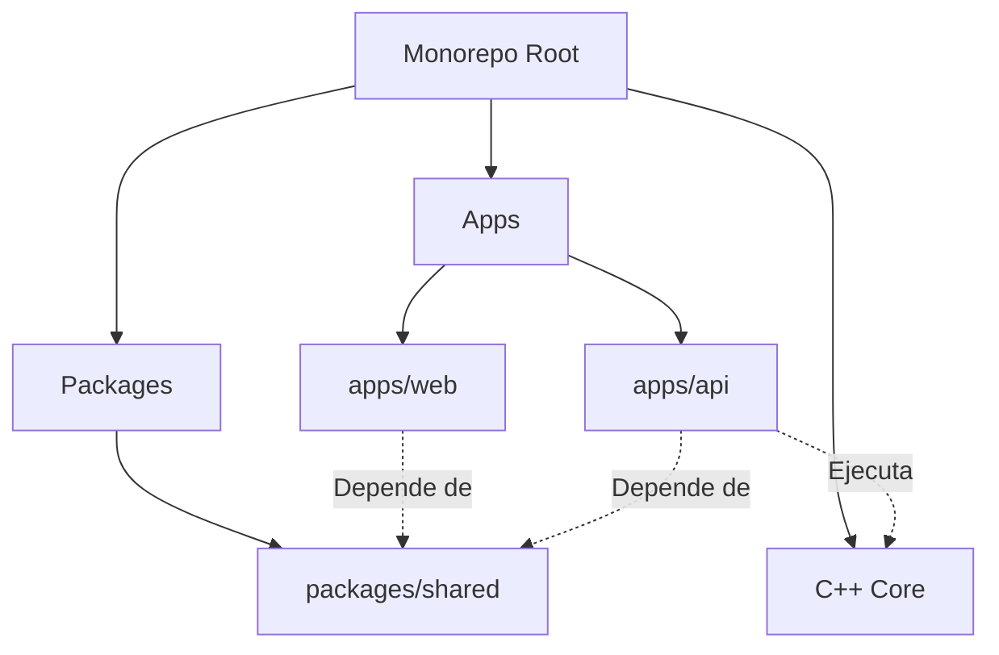

# MaxFlow Shift Optimizer - Architecture Map 🗺️

Este documento sirve como mapa de navegación para el proyecto. Describe la estructura del monorepo, las responsabilidades de cada módulo y cómo fluyen los datos.

## 🏗️ Estructura del Monorepo

El proyecto utiliza **npm workspaces** para gestionar múltiples paquetes en un solo repositorio.

### 📂 Aplicaciones (`apps/`)

*   **`apps/api`** (Backend)
    *   **Tecnología**: Node.js, Express, Prisma (SQLite).
    *   **Responsabilidad**: Gestiona la base de datos, autenticación, lógica de negocio y orquestación del Solver C++.
    *   **Entrada**: `src/index.js`
    *   **Puntos Clave**:
        *   `src/routes`: Definición de endpoints.
        *   `src/controllers`: Lógica de petición/respuesta.
        *   `src/services`: Lógica de negocio reutilizable (llama a Prisma).
        *   `prisma/`: Esquema de base de datos y migraciones.

*   **`apps/web`** (Frontend)
    *   **Tecnología**: React, Vite, TailwindCSS, ShadcnUI.
    *   **Responsabilidad**: Interfaz de usuario para administradores y médicos.
    *   **Entrada**: `src/main.tsx`
    *   **Puntos Clave**:
        *   `src/pages`: Vistas principales (Admin Dashboard, Login, etc.).
        *   `src/components`: Componentes UI reutilizables.
        *   `src/services`: Clientes HTTP para comunicarse con la API.
        *   `src/hooks`: Lógica de estado y autenticación (Zustand).

### 📦 Paquetes Compartidos (`packages/`)

*   **`packages/shared`**
    *   **Tecnología**: TypeScript library.
    *   **Responsabilidad**: Código compartido entre Frontend y Backend para garantizar coherencia ("Single Source of Truth").
    *   **Contenido**:
        *   **Schemas Zod**: Validaciones de formularios y API body (`medico.schema.ts`, `auth.schema.ts`).
        *   **Types**: Tipos TypeScript inferidos de los schemas.

### 🧠 Core (`core/`)

*   **`core/`** (Solver)
    *   **Tecnología**: C++17.
    *   **Responsabilidad**: Ejecución del algoritmo de flujo máximo (Edmonds-Karp) para asignar turnos.
    *   **Funcionamiento**: Recibe JSON por STDIN, procesa el grafo, devuelve JSON por STDOUT. Es invocado por `apps/api` como un subproceso.

---

## 🔄 Flujo de Datos Típico

### 1. Creación de un Médico (Ejemplo)

1.  **Frontend (`apps/web`)**:
    *   Usuario llena formulario en `CreateMedicoPage`.
    *   Valida datos usando `createMedicoBodySchema` importado de `@maxflow/shared`.
    *   Envía POST a `/api/medicos`.
2.  **Shared (`packages/shared`)**:
    *   Provee el esquema de validación que usan tanto Web como API.
3.  **Backend (`apps/api`)**:
    *   Recibe request en `medicos.routes.js`.
    *   Valida payload usando `createMedicoBodySchema` de `@maxflow/shared`.
    *   `medicos.controller.js` llama a `medicos.service.js`.
    *   `medicos.service` usa Prisma para guardar en SQLite.
4.  **Database**:
    *   Se guardan registros en tablas `Medico` y `User`.

---

## 🛠️ Comandos Globales

Desde la raíz del proyecto:

*   `npm install`: Instala dependencias de todos los workspaces.
*   `npm run build -w packages/shared`: Reconstruye la librería compartida (necesario si cambias esquemas).
*   `make dev`: Inicia API y compila Core.
*   `make prod`: Levanta todo con Docker.

## 🧩 Convenciones

*   **Ramas**: `feat/tu-feature`, `fix/tu-fix`.
*   **Commits**: Conventional Commits (`feat: ...`, `fix: ...`, `chore: ...`).
*   **Lenguaje**:
    *   Código y variables: Inglés (preferiblemente) o Español (consistente con lo existente).
    *   Documentación: Inglés (oficial) y Español (usuario).
