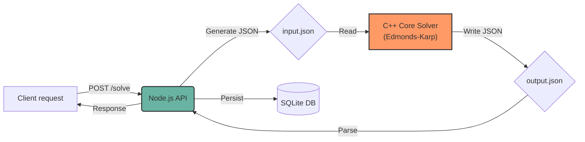

# MaxFlow Shift Optimizer 🏥 ⚡

  

> **More than a simple assignment script: A resilient, explainable, and high-performance personnel management system.**

This project solves the complex problem of hospital shift assignment using maximum flow algorithms. Unlike traditional solutions that simply "fill gaps", MaxFlow Shift Optimizer ensures a mathematically optimal, equitable, and transparent distribution.

---

## 🚀 Why this system? (Value Proposition)

### 🎯 Scope & Capabilities

The system strictly operates as a **Feasibility Engine**. It answers a binary question: *"Is it mathematically possible to satisfy all hospital demand given the constraints?"*

*   **In Scope (Features)**:
    *   Hard Constraints (Maximum shifts per doctor).
    *   Period Constraints (Fairness in weekend/holiday distribution).
    *   Demand Satisfaction (Full coverage of required shifts).
*   **Out of Scope (Future Roadmap)**:
    *   Soft preferences (e.g., "I prefer not to work on Thursdays") (requires *Cost-Flow*).
    *   Seniority weighting (Requires *Weighted Flow*).
    *   Cost minimization.

> *Note: The architecture is decoupled to allow future implementation of a Min-Cost Max-Flow solver that supports these soft constraints without rewriting the API.*

### 1. Mathematical Fairness Guarantee ⚖️
Eliminates favoritism and human error. The **Edmonds-Karp** based assignment engine ensures that maximum capacity and availability rules are strictly respected for all doctors.

### 2. Intelligent Bottleneck Diagnosis 🧠
Numbers don't add up? Most systems fail silently. This system implements a **Min-Cut** analysis to tell you *exactly* why it is impossible to cover demand:
> *"Cannot cover the shift because the 'Pediatricians' group has a cap of 3 total shifts, limiting maximum flow to 15 shifts when 20 are required."*

### 3. Operational Resilience (Auto-Repair) 🛡️
Medical leaves happen. Our **Intelligent Repair** feature allows deactivating a doctor and reassigning *only* their vacant shifts to other available professionals, without altering the schedule of the rest of the team.

---

## 🧩 Model Universality (Adaptability)

Although this implementation is configured for the hospital domain, the underlying design pattern (**Network Flow Resource Allocation**) is agnostic and adaptable to any industry that requires assigning finite resources to temporal demands under strict constraints.

The current architecture can be easily refactored to solve problems in other fields:

| Domain | "Source" (Resource) | "Sink" (Demand) | Capacity Constraint |
|:-------:|:------------------:|:----------------:|:------------------------:|
| **Hospitals** (Current) | Doctors | On-Call Shifts | Max shifts/month |
| **Call Centers** | Agents | Time Slots | Max hours/week |
| **Logistics** | Trucks | Delivery Routes | Cargo Capacity |
| **Events** | Bands/Artists | Stages/Schedules | Show Duration |
| **Education** | Teachers | Classrooms/Subjects | Schedule Availability |

---

## 🏗️ Hybrid Architecture

This system uses a "best of both worlds" architecture, decoupling intensive business logic from computational calculation:

| Component | Technology | Responsibility | Why it was chosen |
|------------|------------|-----------------|-------------------|
| **Core** | **C++ (C++17)** | Graph Algorithms | **Pure Performance:** Manual memory management and low-level optimization to traverse graphs of thousands of nodes in milliseconds. |
| **API** | **Node.js + Express** | Orchestration and Data | **Flexibility:** Rapid development of REST endpoints, easy database integration (Prisma), and asynchronous process handling. |

<details>
<summary>Click to view Mermaid source</summary>


</details>
[](https://mermaid.live/edit#pako:eNpVt01v2zAMgP8KoXM6bH_AQ4EBGwbsUFBphy6CgG6JbSyiQFNOi6L891F26rp1w2CfYkn88vGRSzkqa6QyFPhN5DdfFRy5N0bgvH5v-MTFBPntgU35zL84fnv59vr98t3yx-X7n--W8--WJz-Wa3fHokQAzz_g_frjHN_n-Muz4RILXk34v_CtCzxgwjtB7-jxEZ_wAfexw0e8xyd8wke8xyf8gie8x0d8wid8wHt8wie84Q3e4zM-44Y3vMfnfMFXvMFXvMVXvMMXvMcXvM8L3ucF3-IF3-IlX_IlX_ElX_M1X_MNS75hyTd8wzd8yzd8y3d8y3d8x1J_Qal_oNS_UOpfKPUvlPoXSv0Lpf6FUv9CqX-h1L9Q6l8o9S-U-hdK_Qul_oVS_0Kpf6HUv1DqXyj1L5T6F0r9C6X-hVL_Qql_odS_UOpfKPUvlPoXSv0Lpf6FUv9CqX-h1L9Q6l8o9S-U-hdK_Qul_oVS_0Kpf6HUv1DqXyj1L5T6F0r9C6X-hVL_Qql_odS_UOpfKPUvlPoXSv0Lpf6FUv9CqX_5L6X-lVb_Sqt_pdW_0uqP72E_voX9-Bb241vYj29hP76F_fgW9uNb2I9vYT--hf34FvbjW9iPb2E_voX9-Bb241vYj29hP76F_fgW9uNb2I9vYT--hf34FvbjG_fjW_fjW_fjW_fjW_fjW_fjW_fjW_fjW_fjW_fjW_fjW_fjW_fjW_fjW_fjW_fjW_fjW_fjW_fjW_fjW_fjW_fjW_fjW_fjW_fjW_fjW_fjW_fjW_fjW_fjW_fjW_fjW_fjW_fjW_fjW_fjW_fjW_fjW_fjW_fjW_fjW_fjW_fjW_fjW_fjW_fjW_fjW_fjW_fkfwC8O45k)

---

## 🤓 Technical Decisions and Trade-offs

In developing this system, conscious engineering decisions were made prioritizing robustness and maintainability over premature optimization.

### Implementation Details (Core C++)
The resolution engine (Solver) is optimized for speed and robustness. A conscious decision was made to use an **Adjacency Matrix** instead of lists to guarantee O(1) access to residual capacities, sacrificing a negligible amount of RAM (~16MB for large cases) in exchange for performance and simplicity.

> 📖 For a detailed technical explanation on **Matrix vs List** and graph topology, consult the [Core README](./core/README.md#implementation-detail-matrix-over-adjacency-list).

---

## 🛠️ Installation and Usage

### Prerequisites
-   **Node.js**: v16+
-   **C++ Compiler**: g++ (C++17 support)
-   **Make**: For automation scripts
-   **Operating System**: Linux or macOS.
    > ⚠️ **Windows Users:** It is **mandatory** to use [WSL2 (Windows Subsystem for Linux)](https://learn.microsoft.com/en-us/windows/wsl/install) to run this project, as automation scripts (`.sh`) and system signal handling are not compatible with native PowerShell or CMD.

### Quick Start (Dev Environment)

The project includes scripts that compile the C++ core and start the API automatically.

```bash
# 1. Compile Core and start API in development mode
make dev

# The API will be ready at http://localhost:3000
# Swagger Documentation at http://localhost:3000/api-docs
```

### Loading Test Scenarios

Don't start from scratch. Use our seeds to test real situations:

*   **Ideal Scenario:** Loads doctors and shifts where everything fits perfectly.
    ```bash
    make feasible
    ```

*   **Stress Scenario (Infeasible):** Forces the system to fail to test Min-Cut diagnosis.
    ```bash
    make infeasible
    ```

*   **Repair Scenario:** Simulates a doctor dropping out to test the shift reassignment feature.
    ```bash
    make repair
    ```
    > *Follow the instructions in the terminal to trigger the repair.*

*   **Clean Test Environment:** Starts an empty QA environment (`test.db`) for manual testing.
    ```bash
    make test
    ```

### 🔌 API Snapshot (MVP)
The API is designed to be the single interface for managing data and triggering the solver. These are the most relevant endpoints for the MVP flow:

| Action | Method | Endpoint | Notes |
| --- | --- | --- | --- |
| Authenticate | `POST` | `/auth/login` | Returns JWT token. |
| List doctors | `GET` | `/medicos` | Requires auth. |
| Create doctor | `POST` | `/medicos` | Admin-only. |
| Configure global limits | `PUT` | `/configuracion` | Admin-only. |
| Solve assignments | `POST` | `/asignaciones/resolver` | Runs core solver and persists results if feasible. |
| Repair assignments | `POST` | `/asignaciones/reparar` | Reassigns only missing shifts. |
| Get assignments | `GET` | `/asignaciones` | Returns current schedule. |

> 📘 Full contract and request/response examples are documented in Swagger (`/api-docs`) and in the API README (`/api/README.md`).

### Docker Usage (Recommended for Production) 🐳

The project includes an optimized **Multi-stage Build** configuration to generate a lightweight and secure image.

> **Tip (Linux):** To run these commands without `sudo`, ensure your user is in the docker group:
> `sudo usermod -aG docker $USER` (requires re-login or `newgrp docker` to apply).

```bash
# Start production environment (Detached mode)
make prod
# Or manually: docker-compose up --build -d

# Stop production environment
make stop
# Or manually: docker-compose down
```

### Production Configuration (Security) 🛡️
When deploying to production, you **should** configure the initial admin credentials using environment variables to avoid using the insecure defaults.

Set the following variables in your `docker-compose.yml` or your deployment environment:
*   `ADMIN_EMAIL`: Custom admin email.
*   `ADMIN_PASSWORD`: Secure password.
*   `ADMIN_NAME`: (Optional) Admin name.

**Example in docker-compose:**
```yaml
environment:
  - ADMIN_EMAIL=ops@hospital.com
  - ADMIN_PASSWORD=StrongPassword123!
```

**If these variables are NOT set**, the system will default to:
*   **Email**: `admin@hospital.com`
*   **Password**: `admin123`
*(Not recommended for public environments)*

> **Note:** The production database (`prod.db`) is stored in a **Docker Volume** (`sqlite_data`) to ensure persistence and security. It is not directly accessible as a file on the host (unless you inspect the volume).


## ❓ Troubleshooting

*   **Error: `make: g++: Command not found`**
    *   Ensure you have `g++` installed (`sudo apt install build-essential` on Ubuntu).
*   **Error: `EADDRINUSE: address already in use :::3000`**
    *   Another process is using port 3000. Kill it with `killall -9 node` or change the port in `.env`.
*   **Docker: `permission denied` connecting to socket**
    *   Ensure your user is in the docker group (`sudo usermod -aG docker $USER`) or run with `sudo`.

## 📂 Project Structure

*   `/core`: **The Brain.** C++ source code (Edmonds-Karp Solver).
    > 📖 [See technical documentation of the algorithm and data schemas](./core/README.md)
*   `/api`: **The Nervous System.** Node.js REST API and DB management (Prisma).
*   `/scripts`: Utilities to automate the development lifecycle.

---
*Developed with ❤️ and C++ by [Nahuel Prieto]*
