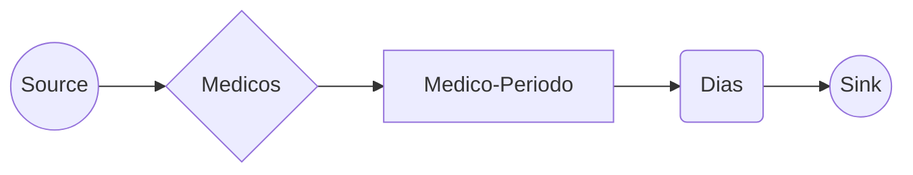

# MaxFlow Shift Optimizer - Core Module

This module implements the high-performance solver engine using C++17. It utilizes network flow algorithms to optimize hospital shift assignments.

## 🧠 Algorithm: Edmonds-Karp

The core uses the **Edmonds-Karp** algorithm, which is a specific implementation of the Ford-Fulkerson method that uses **Breadth-First Search (BFS)** to find augmenting paths in the residual graph.

- **Time Complexity**: $O(V E^2)$
- **Space Complexity**: $O(V + E)$ (Adjacency List)

### Why Edmonds-Karp?
Given the constraints of hospital shifts (typically < 1000 nodes/steps), Edmonds-Karp offers a perfect balance between implementation complexity and performance. It guarantees termination and provides the shortest augmenting path, ensuring efficient flow distribution.

## 🏗️ Graph Topology (3-Layer Network)

To model the constraints, we construct a flow network with specific layers:



1.  **Source → Medico**:
    *   **Capacity**: `maxGuardiasTotales` (Global Limit, e.g., 5).
    *   **Meaning**: Limits the total number of shifts a doctor can take.

2.  **Medico → Medico-Periodo**:
    *   **Capacity**: `maxGuardiasPorPeriodo` (e.g., 1 per weekend).
    *   **Meaning**: Enforces fair distribution within specific time blocks.

3.  **Medico-Periodo → Dia**:
    *   **Capacity**: `1` (Boolean).
    *   **Meaning**: Represents the assignment of a doctor to a specific day. Only exists if the doctor is **Available** on that day.

4.  **Dia → Sink**:
    *   **Capacity**: `medicosPorDia` (Demand, e.g., 2 doctors needed).
    *   **Meaning**: Ensures the day is fully covered.

## ⚠️ Bottleneck Analysis (Min-Cut)

When a feasible assignment is impossible (`max_flow < required_flow`), the solver performs a **Min-Cut Analysis**.
It identifies the edges that are "saturated" in the cut between the reachable component from Source and the rest.

*   **Saturated Source Edge**: The doctor has reached their max global shifts.
*   **Saturated Sink Edge**: The day could not be covered (understaffing).

## 🛠️ Build & Run

### Prerequisites
*   `g++` (C++17 support)
*   `make`

### Compilation
```bash
cd core
make
# Output: build/solver
```

### Testing
We use a custom test runner (or CTest logic).
```bash
make test
```

## 🔌 IO Specification (Pipes)

The solver is designed to be run as a child process. It reads **JSON from stdin** and writes **JSON to stdout**.

### Input Schema
```json
{
  "medicos": ["ID1", "ID2"],
  "dias": ["2024-01-01", "2024-01-02"],
  "periodos": [
    { "id": "P1", "dias": ["2024-01-01"] }
  ],
  "disponibilidad": {
    "ID1": ["2024-01-01"]
  },
  "config": {
    "maxGuardiasTotales": 5,
    "maxGuardiasPorPeriodo": 1,
    "medicosPorDia": 1
  }
}
```

### Output Schema
```json
{
  "factible": true,
  "diasCubiertos": 10,
  "diasRequeridos": 10,
  "asignaciones": [
    { "medico": "ID1", "dia": "2024-01-01" }
  ],
  "bottlenecks": []
}
```
